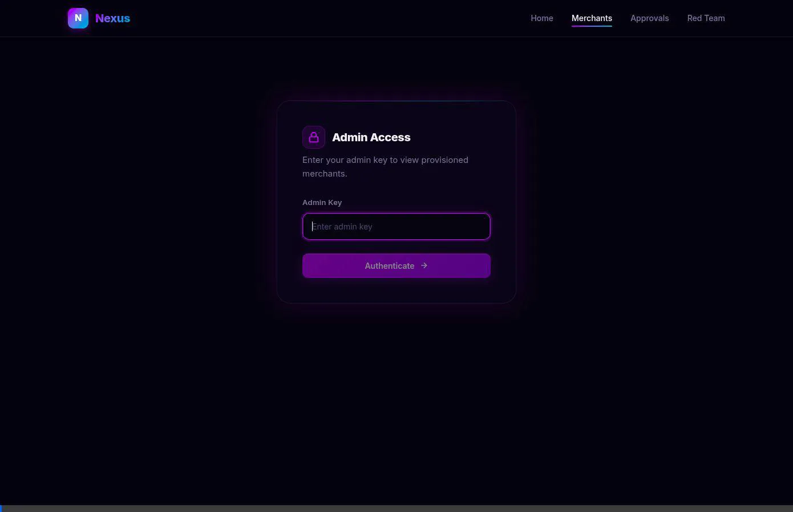
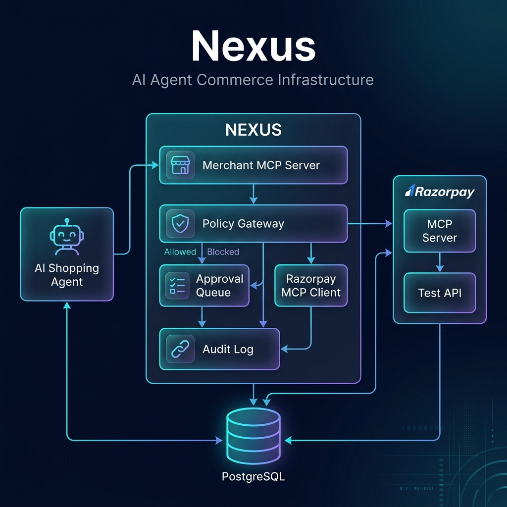

<div align="center">
  <br />
  <h1>🚀 Nexus</h1>
  <p><b>Enterprise-Grade Agentic Commerce Infrastructure for Merchants</b></p>
  <br />

  [](https://go.dev/)
  [](LICENSE)
</div>

---

## 🎥 Platform Overview

*(Watch our high-speed run-through of the Nexus platform in action, including merchant onboarding, the human approval queue, and the automated security testing suite.)*



---

## 💡 The Problem

As AI shopping agents evolve into a legitimate, high-volume sales channel, merchants face a critical infrastructure gap. Currently, there is **no safe, standardized way** to accept agent-driven autonomous transactions:

1. **Unbounded Financial Risk:** Without strict safeguards, an agent could be manipulated via prompt injection to purchase massive quantities of expensive items (e.g., 500 units of a $10,000 product).
2. **Missing Infrastructure:** There is no universal standard interface for AI agents to natively browse merchant catalogs, verify stock, and execute complex multi-step orders.
3. **Zero Accountability:** If an autonomous transaction behaves unexpectedly, merchants lack the cryptographically secure audit trails needed for compliance, debugging, and dispute resolution.

---

## ⚡ The Solution: Nexus

**Nexus** is a robust, self-hosted commerce gateway that makes any merchant natively transactable by AI buyers end-to-end. 

By exposing a standardized **Model Context Protocol (MCP)** storefront, Nexus allows AI agents to interact with catalogs seamlessly while guaranteeing that **every single monetary action is explainable, bounded, and cryptographically gated**. 

Critically, **no LLM sits in the enforcement path**. All security policies and spend limits are evaluated deterministically in compiled Go code with sub-millisecond latency, entirely eliminating AI hallucination risks during the checkout and payment phases.

### The Request Lifecycle:
`AI Agent → Merchant MCP Server → Deterministic Policy Gateway → Razorpay API → Audit Log`

If an agent's request violates a policy boundary (e.g., exceeding a spend cap or velocity limit), the transaction fails gracefully and is safely routed to a **Human Approval Queue**. This ensures merchants never lose a legitimate, high-value sale due to a strict automated rule.

---

## 🚀 Core Capabilities

*   🛡️ **Deterministic Policy Engine:** Enforces session spend caps, per-SKU quantity limits, velocity caps (rate limiting), category allowlists, and strict geo-fencing.
*   ⛓️ **Cryptographic Audit Log:** A hash-chained, append-only ledger records every decision made by the agent and the gateway, guaranteeing tamper-proof compliance.
*   👨‍⚖️ **Human-in-the-Loop Approvals:** Blocked or anomalous requests instantly surface in a React-based dashboard for manual merchant review and overriding.
*   🛍️ **Transactable End-to-End:** Full commerce lifecycle (catalog search, product retrieval, inventory checking, and purchasing) is exposed natively as standard MCP tools.
*   💳 **Seamless Payments:** Integrates natively with the Razorpay API to handle secure payment capture and reconciliation without exposing merchant secrets to the AI.
*   🔄 **Idempotent Execution:** All purchase requests are strictly deduplicated using idempotency keys, preventing double-charging during network partitions or agent retries.

---

## 🛠️ Exposed MCP Tools

The **Merchant MCP Server** acts as the universal adapter between external LLM agents and the merchant's private catalog/payment gateway. It exposes the following tools to the AI:

| Tool Name | Description | Required Parameters |
| :--- | :--- | :--- |
| `search_products` | Browse the catalog using rich filters. | `query`, `category`, `min_price`, `max_price`, `in_stock_only` |
| `get_product` | Retrieve exhaustive details and metadata for a specific item. | `product_id` |
| `check_availability` | Verify real-time inventory allocation for a given SKU. | `sku` |
| `purchase` | Initiate a secure transaction evaluated by the Policy Gateway. | `buyer_id`, `session_id`, `sku`, `quantity`, `idempotency_key` |
| `get_order_status` | Track the status of a pending, approved, or completed order. | `order_id` |

---

## 💻 Technology Stack

Nexus is engineered for extreme low-latency, transactional safety, and high reliability:

*   **Backend Services:** Go 1.22 (Leveraging zero-allocation paths for policy evaluation, strict typing)
*   **Database:** PostgreSQL 15 (ACID compliance, JSONB for extensible metadata, transactional tracking)
*   **Frontend UI:** React.js, Tailwind CSS, Vite (Responsive merchant dashboards and onboarding portals)
*   **Agent Protocol:** Model Context Protocol (MCP) for standardized LLM interaction
*   **Payment Infrastructure:** Razorpay API via the official `razorpay-mcp-server` integration
*   **Deployment:** Docker & Docker Compose for rapid, single-command orchestration

---

## 🏗️ Architecture & Core Services



Nexus operates as a constellation of highly cohesive, horizontally scalable microservices:

1. **Merchant MCP Server (`:8082`):** The external-facing interface. Parses AI agent intent, validates payload schemas, and routes actions to internal services.
2. **Policy Gateway (`:8081`):** The core enforcement engine. Evaluates deterministic rules (spend caps, velocity, geo-fencing) against Postgres state before any payment is authorized.
3. **Approval Queue (`:8083`):** The human-in-the-loop fallback service. Captures blocked transactions, stores reasoning, and holds them pending merchant review.
4. **Admin Portal (`:8084`):** The React-based dashboard for merchants to configure policies, view the hash-chained audit log, and approve/reject blocked requests.
5. **Razorpay Client:** Manages the secure, authenticated connection to Razorpay's financial infrastructure to finalize payments post-approval.

---

## 🚨 Automated Security Validation (Red Team Suite)

To guarantee the robustness of the Policy Engine, Nexus ships with a built-in automated Red Team testing suite. Merchants can run this suite against their live stack to simulate a rogue AI buyer attempting to circumvent policy boundaries.

```bash
go run cmd/redteam/main.go config.yaml
```

| Attack Vector | Expected Outcome |
|---|---|
| Prompt injection — excessive quantity | **Blocked:** per-SKU cap correctly enforced |
| Prompt injection — manipulated price | **Blocked:** catalog truth-price strictly enforced |
| Velocity abuse (DDoS simulation) | **Blocked:** rate limits and velocity caps enforced |
| Category escape attempt | **Blocked:** unauthorized category purchase denied |
| Geo-fencing bypass | **Blocked:** unauthorized pincode/region restricted |
| Idempotency replay attack | **Deduplicated:** original order state securely returned |
| Hash chain manipulation | **Detected:** audit chain integrity verification triggers alert |

---

## 🚀 Quick Start Guide

**Groq LLM integration** – The portal now exposes an `/api/ai/complete` endpoint that forwards user prompts to the Groq API (model default `mixtral-8x7b-32768`). Set the environment variables `GROQ_API_KEY` (required) and optional `GROQ_MODEL` before running `./scripts/demo.sh`. The UI page **AI Purchase Demo** (`/ai-purchase`) showcases the suggestion flow and then lets you execute a purchase via the MCP proxy.

**Podman Support** – The demo orchestration script now uses *Podman* instead of Docker. Ensure you have `podman` (v4+ includes the `compose` subcommand) installed. All Docker‑related commands in `scripts/demo.sh` and `scripts/demo-preload.sh` have been replaced with their Podman equivalents.


**Prerequisites:** Go 1.22+, PostgreSQL 15+, Podman

1. **Clone the Repository:**
```bash
git clone https://github.com/razorpay/nexus.git
cd nexus
```

2. **Configure Environment:**
Create a `.env` file at the root with your payment gateway credentials:
```env
RAZORPAY_KEY_ID=your_key_id
RAZORPAY_KEY_SECRET=your_key_secret
# Groq LLM – add your test API key (required for AI suggestions)
GROQ_API_KEY=your_groq_api_key
# optional – choose a model (default: mixtral-8x7b-32768)
GROQ_MODEL=mixtral-8x7b-32768
```

3. **Start the Infrastructure:**
We provide an automated orchestration script that spins up PostgreSQL, compiles all Go microservices, seeds the database with a test catalog, and starts the UI portals.
```bash
./scripts/demo.sh
```

4. **Explore the Ecosystem:**
- **Admin Portal (Merchant Dashboard):** [http://localhost:8084](http://localhost:8084) (Default Admin Key: `nexus_admin_default`)
- **Approval Queue:** [http://localhost:8084/approvals](http://localhost:8084/approvals)
- **Security Suite:** [http://localhost:8084/redteam](http://localhost:8084/redteam)
- **AI Purchase Demo:** [http://localhost:8084/ai-purchase](http://localhost:8084/ai-purchase)
- **Merchant MCP Endpoint:** `http://localhost:8082/mcp/{store_id}`

---

## 👨‍💻 Clean Architecture Layout

The codebase strictly follows Domain-Driven Design (DDD) and Clean Architecture principles:

```
cmd/                # Entrypoints for all microservices (gateway, mcp, portal, redteam)
internal/app/
  ├── service/      # Core business logic (Policy Engine, Gateway, Audit, Queue)
  ├── repository/   # PostgreSQL data access layer (Interfaces and implementations)
  ├── model/        # Domain entities and strict types
  ├── mcp/          # MCP tool definitions and schema validation
  └── integration/  # End-to-end integration test suite
internal/pkg/       # Shared utilities (structured logger, config parsing, API clients)
migrations/         # Versioned SQL migration files for Postgres
web/                # Frontend React application (Admin Portal and Dashboards)
assets/             # Architecture diagrams and demonstration media
scripts/            # Orchestration, CI/CD, and deployment scripts
```
