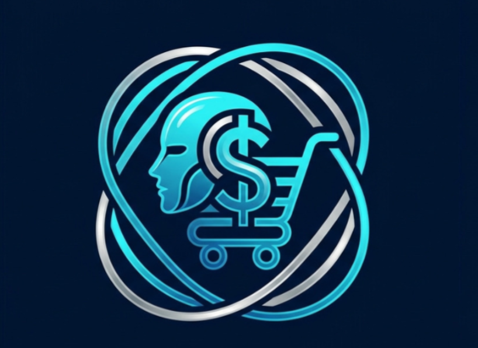
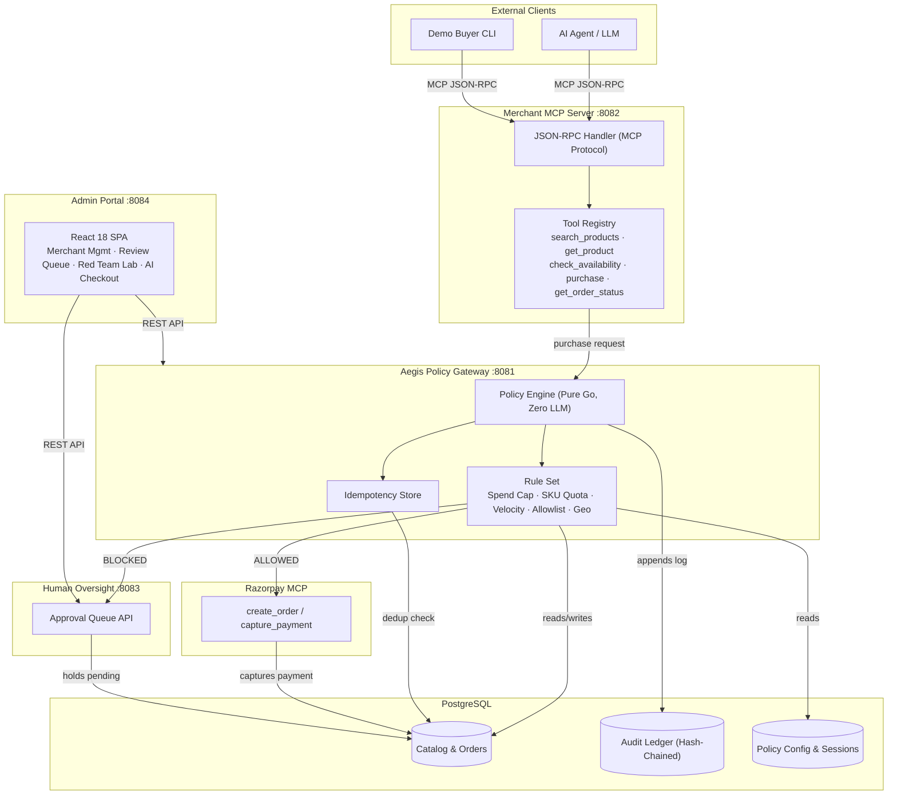

<div align="center">
  <br />
  
  <h1>Nexus</h1>
  <p><b>Agentic Commerce Infrastructure for Merchants</b></p>
  <br />

  [](https://go.dev/)
  [](https://www.postgresql.org/)
  [](https://reactjs.org/)
  [](https://modelcontextprotocol.io/)
  [](LICENSE)
</div>

---

## Demo


---

## The Problem

As AI shopping agents evolve from search assistants into autonomous purchasing delegates, merchants face three infrastructure gaps:

1. **Unbounded financial risk.** LLMs can be manipulated via prompt injection or context drift to place unauthorized, high-value transactions.
2. **No universal standard.** Traditional e-commerce platforms have no machine-readable protocol for AI agents to discover catalogs, check inventory, and execute multi-step checkouts.
3. **Zero auditability.** Non-deterministic LLM actions leave merchants without cryptographically verifiable audit trails for dispute resolution or compliance.

---

## What Nexus Does

Nexus is a self-hosted commerce gateway that makes any merchant natively transactable by AI agents, end-to-end.

It combines an open **Model Context Protocol (MCP)** interface with a zero-LLM **Aegis Policy Engine** so that every monetary action is explainable, bounded, and cryptographically gated.

```
AI Agent ──► Merchant MCP Server ──► Aegis Policy Gateway ──► Razorpay API ──► Audit Ledger
                                              │
                                       (Policy Violation)
                                              ▼
                                    Human Approval Queue
```

**Engineering guarantees:**

- **Zero LLM in the enforcement path.** Policy evaluation is compiled Go with sub-millisecond latency. No hallucination risk during payment capture.
- **Bounded execution.** Enforces session spend caps, per-SKU quantity limits, velocity rate limiting, category allowlists, and regional geo-fencing.
- **Cryptographic audit chain.** SHA-256 hash-chained append-only ledger verifies log integrity against tampering.
- **Graceful human-in-the-loop.** Blocked transactions do not drop silently; they route to a merchant review queue for manual override.

---

## MCP Tools

The Merchant MCP Server is the protocol layer between external AI agents and the merchant's payment infrastructure.

| Tool | Description | Parameters |
| :--- | :--- | :--- |
| `search_products` | Search catalog with price and category filters | `query`, `category`, `min_price`, `max_price` |
| `get_product` | Fetch SKU specs and inventory | `product_id` |
| `check_availability` | Real-time stock reservation check | `sku` |
| `purchase` | Submit a purchase request to the policy engine | `buyer_id`, `session_id`, `sku`, `quantity`, `idempotency_key` |
| `get_order_status` | Query status of a pending or completed order | `order_id` |

---

## Architecture



**Services:**

1. **Merchant MCP Server (`:8082`)** — Handles LLM JSON-RPC connections, validates schemas, translates tool calls.
2. **Aegis Policy Gateway (`:8081`)** — Evaluates deterministic rules against PostgreSQL state before authorizing charges.
3. **Human Approval Service (`:8083`)** — Holds policy-blocked transactions and exposes resolution endpoints.
4. **Admin Portal (`:8084`)** — React 18 dashboard for merchant onboarding, policy management, review queue, and security lab.
5. **Razorpay Integration** — Creates and captures payments via official Razorpay APIs.

---

## Red Team Suite

Nexus ships an automated attack simulation suite to validate policy enforcement against prompt-injected or malicious agents.

```bash
go run cmd/redteam/main.go config.yaml
```

| Attack | Enforcement Layer | Outcome |
|---|---|---|
| Excessive quantity injection | Per-SKU quota rule | Blocked → routed to approval queue |
| Price tampering | Catalog truth verification | Blocked → price mismatch rejected |
| Velocity spam | Sliding-window rate limiter | Blocked → HTTP 429 |
| Category escape | Category allowlist | Blocked → unauthorized category denied |
| Geo-fencing bypass | Pincode / country rule | Blocked → regional restriction applied |
| Replay attack | Idempotency key store | Deduplicated → cached state returned |
| Audit chain tampering | Cryptographic hash chain | Detected → chain validation alert |

---

## Quick Start

**Prerequisites:** Go 1.22+, PostgreSQL 15+ (or Podman/Docker), Node.js 20+

### Option A — Podman (recommended)

Runs PostgreSQL + all services in a single pod.

```bash
git clone https://github.com/razorpay/nexus.git
cd nexus

cp .env.example .env
# Add RAZORPAY_KEY_ID, RAZORPAY_KEY_SECRET, and GROQ_API_KEY to .env

make podman-up
```

```bash
make podman-down   # to stop
```

### Option B — Local development

```bash
cp config.yaml.example config.yaml
# Fill in credentials

./scripts/demo.sh   # builds, migrates, seeds, and starts all services
```

---

## Endpoints

Once running:

| Service | URL | Auth |
|---|---|---|
| Merchant Dashboard | http://localhost:8084 | `nexus_admin_default` |
| Store Management | http://localhost:8084/merchants | same |
| Human Approval Queue | http://localhost:8084/approvals | same |
| Security Test Lab | http://localhost:8084/redteam | same |
| AI Checkout Simulator | http://localhost:8084/ai-purchase | none |
| 3D Aegis Control Plane | http://localhost:8084/aegis-demo | none |
| MCP Endpoint | `http://localhost:8082/mcp/{store_id}` | store API key |

---

## Repository Layout

```
cmd/
  aegis-gateway/     policy engine entrypoint
  merchant-mcp/      MCP server
  portal/            portal backend + static file server
  redteam/           attack simulation suite
  demo-buyer/        AI purchase scenario harness
  seed-catalog/      product catalog seeder
internal/
  app/
    service/         business logic (policy, audit, approval, MCP)
    repository/      PostgreSQL data access
    model/           domain entities and schemas
  pkg/               shared logger, config, clients
migrations/          versioned SQL migrations
web/portal/          React 18 + Three.js + Vite frontend
scripts/             deployment and automation scripts
```

---

## License

MIT
